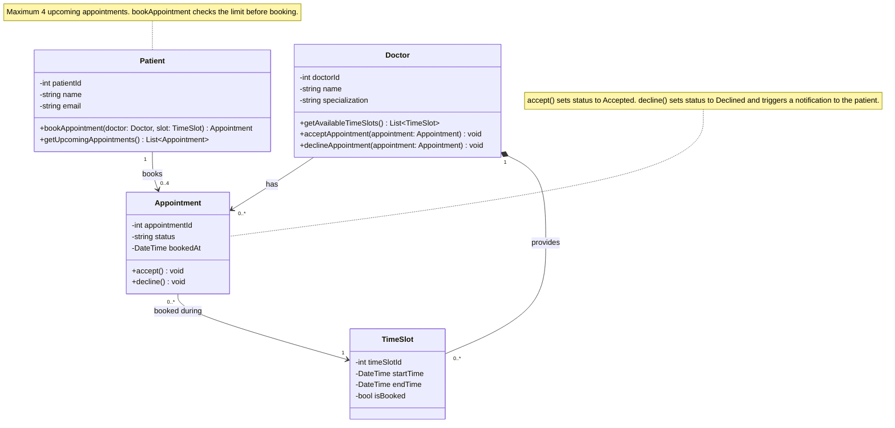

```mermaid
classDiagram
    class Patient {
        -int patientId
        -string name
        -string email
        +bookAppointment(doctor: Doctor, slot: TimeSlot) Appointment
        +getUpcomingAppointments() List~Appointment~
    }

    class Doctor {
        -int doctorId
        -string name
        -string specialization
        +getAvailableTimeSlots() List~TimeSlot~
        +acceptAppointment(appointment: Appointment) void
        +declineAppointment(appointment: Appointment) void
    }

    class Appointment {
        -int appointmentId
        -string status
        -DateTime bookedAt
        +accept() void
        +decline() void
    }

    class TimeSlot {
        -int timeSlotId
        -DateTime startTime
        -DateTime endTime
        -bool isBooked
    }

    Patient "1" --> "0..4" Appointment : books
    Doctor "1" --> "0..*" Appointment : has
    Doctor "1" *-- "0..*" TimeSlot : provides
    Appointment "0..*" --> "1" TimeSlot : booked during

    note for Patient "Maximum 4 upcoming appointments. bookAppointment checks the limit before booking."
    note for Appointment "accept() sets status to Accepted. decline() sets status to Declined and triggers a notification to the patient."
```