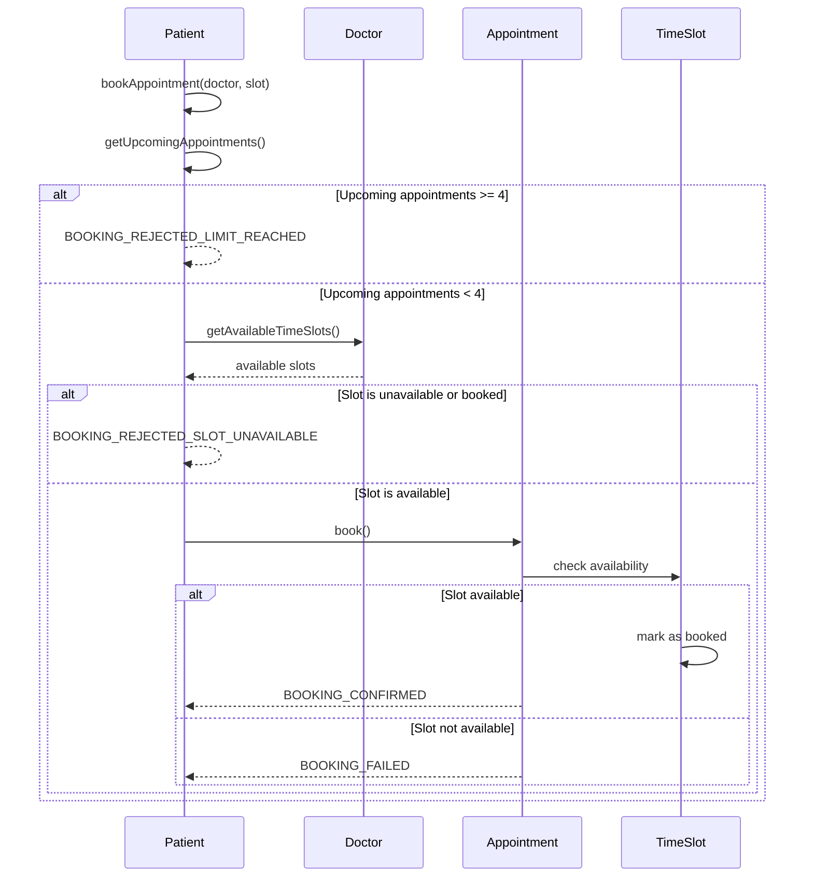

```mermaid
sequenceDiagram
    participant Patient
    participant Doctor
    participant Appointment
    participant TimeSlot

    Patient->>Patient: bookAppointment(doctor, slot)
    Patient->>Patient: getUpcomingAppointments()
    alt Upcoming appointments >= 4
        Patient-->>Patient: BOOKING_REJECTED_LIMIT_REACHED
    else Upcoming appointments < 4
        Patient->>Doctor: getAvailableTimeSlots()
        Doctor-->>Patient: available slots
        alt Slot is unavailable or booked
            Patient-->>Patient: BOOKING_REJECTED_SLOT_UNAVAILABLE
        else Slot is available
            Patient->>Appointment: book()
            Appointment->>TimeSlot: check availability
            alt Slot available
                TimeSlot->>TimeSlot: mark as booked
                Appointment-->>Patient: BOOKING_CONFIRMED
            else Slot not available
                Appointment-->>Patient: BOOKING_FAILED
            end
        end
    end
```